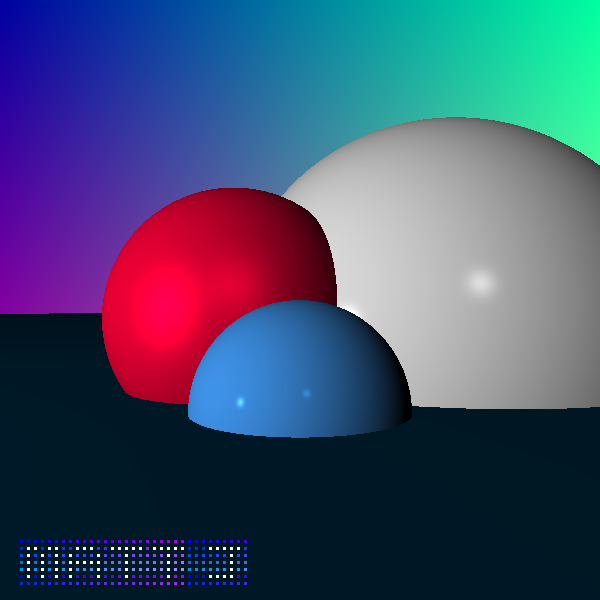

# tinyray
A simple raytracer in exactly 450 lines of C-code.



### Features
 * Sphere-Ray Intersection
 * Materials
 * Diffuse and Specular Lighting
 * Point, Directional, and Ambient Lights
 * Custom Floating-Point Vector Library
 * Output to image with stb_image
 * Gradient Background
 * Watermark
 
### Building
Find a compiler and build `tinyray.c`. Run the executable and it'll create an image called 'output.bmp' in that directory. Simple as that!

Some examples:

```
# Building with gcc
$ gcc tinyray.c -o "tinyray"

# Building with cl
> cl tinyray.c
```

tinyray uses [the excellent stb_image_write library](https://github.com/nothings/stb/blob/master/stb_image_write.h) for outputting a bitmap image.

### License
Public Domain - Do whatever you like!

Credit would be very much appreciated though :)

### Helpful Resources
I created this toy raytracer to learn about basic raytracing (and for fun, of course), taking inspiration from the following resources:
 - [Gabriel Gambetta: Computer Graphics From Scratch](https://www.gabrielgambetta.com/computer-graphics-from-scratch/basic-ray-tracing.html)
 - [Scratch A Pixel: Minimal Ray Tracing](https://www.scratchapixel.com/lessons/3d-basic-rendering/minimal-ray-tracer-rendering-simple-shapes/ray-sphere-intersection)
 - [ssloy's tinyraytracer](https://github.com/ssloy/tinyraytracer)

The first link is especially helpful in understanding how raytracing works from a mathematical perspective.


https://github.com/mjakeman/tinyray

**I created this for fun for the UoA ENGGEN 131 Art Challenge**
